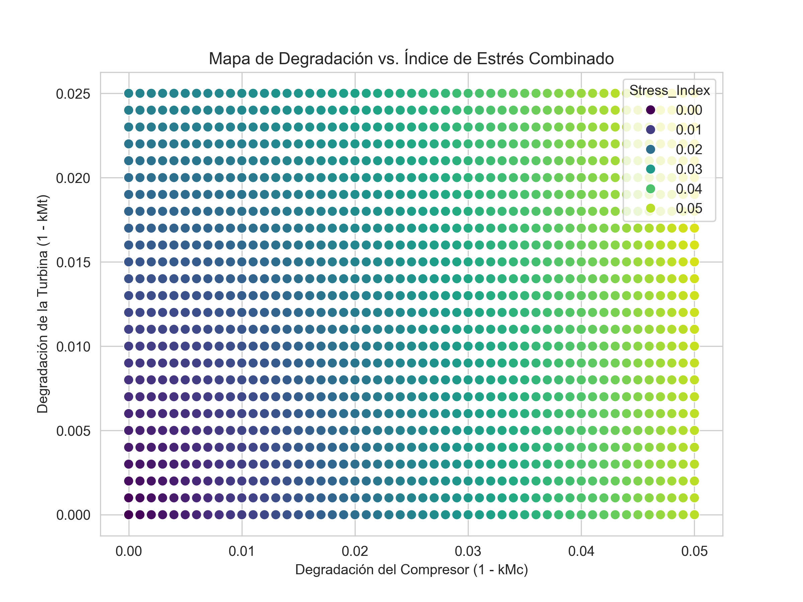
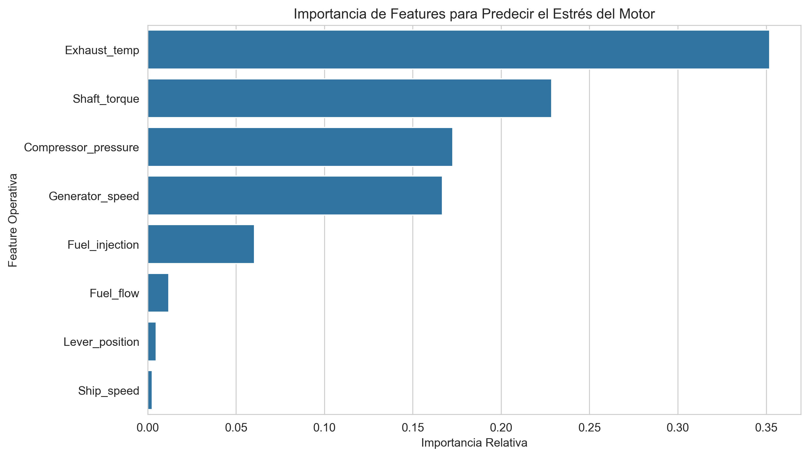

# Sistema Adaptativo de Gestión de la "Huella de Estrés" del Motor (AESF)

 Este repositorio contiene el código y la metodología para un sistema de inteligencia artificial que cuantifica, predice y optimiza el estrés operativo de una turbina de gas de propulsión naval. El objetivo es prolongar la vida útil del motor y reducir costos de mantenimiento mediante la identificación de perfiles operativos de mínimo esfuerzo.

---

## Índice

1.  [Logros Clave](#logros-clave)
2.  [Introducción a las Turbinas de Gas](#introducción-a-las-turbinas-de-gas-marinas)
3.  [Planteamiento del Problema](#planteamiento-del-problema-el-desgaste-oculto-y-sus-consecuencias)
4.  [La Solución Propuesta](#la-solución-un-sistema-adaptativo-para-la-gestión-del-estrés-del-motor-aesf)
5.  [Estructura del Repositorio](#estructura-del-repositorio)
6.  [Instrucciones de Uso](#instrucciones-de-uso)
7.  [Tecnologías Utilizadas](#tecnologías-utilizadas)

---

## Logros Clave

* **Métrica de Estrés Unificada:** Se desarrolló un `Stress_Index` que traduce la degradación del compresor y la turbina en un único indicador de salud del motor.
* **Modelo Predictivo de Alta Precisión:** Se entrenó un modelo de Gradient Boosting capaz de predecir el `Stress_Index` con un **R² de 97.46%** a partir de datos operativos en tiempo real.
* **Optimización Inteligente:** Se implementó un Algoritmo Genético que descubre el **perfil operativo óptimo** para alcanzar una velocidad objetivo minimizando el estrés del motor, proporcionando recomendaciones accionables.

---

## Introducción a las Turbinas de Gas Marinas

Una turbina de gas es un motor que convierte la energía del combustible en potencia mecánica. Su operación se basa en tres componentes críticos:
* **Compresor:** Succiona y comprime aire. Su salud se mide por el coeficiente `kMc`.
* **Cámara de Combustión:** Mezcla aire con combustible (`Fuel flow`, `TIC`) y lo enciende.
* **Turbina:** Los gases calientes se expanden a través de ella, generando el par motor (`GTT`) para mover el buque. Su salud se mide por el coeficiente `kMt`.

En el ámbito naval, son vitales por su alta potencia, pero operan en condiciones extremas que aceleran su desgaste.

---

## Planteamiento del Problema: El Desgaste Oculto y sus Consecuencias

Cada decisión operativa (velocidad, aceleración) deja una **"huella de estrés"** en el motor. El problema es que esta huella es invisible para los operadores. No pueden cuantificar el costo real, en términos de vida útil, de sus decisiones, lo que lleva a:
* Mantenimiento reactivo y costoso.
* Operación ineficiente que acelera el desgaste sin saberlo.
* Riesgos de seguridad por fallos inesperados en alta mar.

El desafío es: **¿Cómo podemos medir y minimizar este estrés sin sacrificar los objetivos de la misión?**

---

## La Solución: Un Sistema Adaptativo para la Gestión del Estrés del Motor (AESF)

Este programa ofrece una solución integral en tres pasos:

### Paso 1: Cuantificar la "Huella de Estrés"
Creamos el `Stress_Index` para unificar la degradación del compresor y la turbina en un solo número fácil de interpretar.
$$\text{Stress\_Index} = \sqrt{(1 - kMc)^2 + (1 - kMt)^2}$$



### Paso 2: Predecir el Estrés en Tiempo Real
El modelo de **Gradient Boosting** aprende la relación entre los parámetros operativos y el `Stress_Index`. Con una precisión del **97.46%**, puede estimar el estrés del motor en tiempo real usando solo datos de los sensores.



### Paso 3: Optimizar para la Mínima Degradación
Usando un **Algoritmo Genético**, el sistema responde a la pregunta clave: *Para una velocidad objetivo, ¿cuál es la configuración de motor que produce el menor estrés posible?* El algoritmo encuentra este perfil óptimo, ofreciendo una receta precisa para una operación eficiente y segura.


---

## Estructura del Repositorio

```
AESF_motor_optimizer/
├── data/
│   └── data.csv
├── results/
│   ├── plots/
│   └── optimal_profile.txt
├── src/
│   └── adaptive_stress_optimizer.py
├── .gitignore
├── README.md
└── requirements.txt
```

---

## Instrucciones de Uso

1.  **Clonar el repositorio:**
    ```bash
    git clone [https://github.com/tu-usuario/AESF_motor_optimizer.git](https://github.com/tu-usuario/AESF_motor_optimizer.git)
    cd AESF_motor_optimizer
    ```
2.  **Crear un entorno virtual (recomendado):**
    ```bash
    python -m venv env
    source env/bin/activate  # En Windows: env\Scripts\activate
    ```
3.  **Instalar las dependencias:**
    ```bash
    pip install -r requirements.txt
    ```
4.  **Colocar los datos:**
    Asegúrate de que tu archivo `data.csv` esté dentro de la carpeta `data/`.

5.  **Ejecutar el análisis:**
    ```bash
    python src/adaptive_stress_optimizer.py
    ```
    El script se ejecutará, imprimirá los resultados en la consola y guardará los gráficos y el perfil óptimo en la carpeta `results/`.

---

## Tecnologías Utilizadas

* **Python 3.x**
* **Pandas & NumPy:** Manipulación y análisis de datos.
* **Scikit-learn:** Para el modelo de Gradient Boosting y preprocesamiento.
* **Matplotlib & Seaborn:** Visualización de datos.
* **PyGAD:** Para la implementación del Algoritmo Genético.
